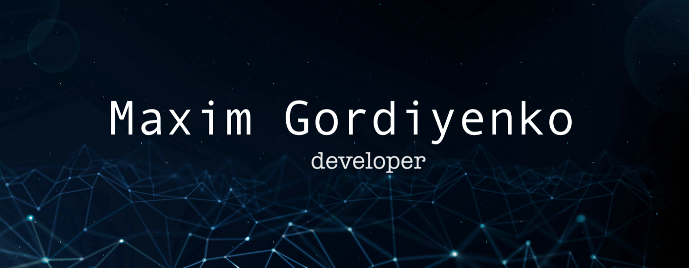

  

  
  
  

### 🛠 Languages and Tools

### 📖 Latest blog posts

<!-- start-blog-posts -->
- [Sort of array](https://blog.magxgor.com/post/sort-of-array)
- [10 React Patterns](https://blog.magxgor.com/post/usefull-react-patterns)
- [OOP in Javascript](https://blog.magxgor.com/post/Javasript-OOP)
- [Await in javascript?](https://blog.magxgor.com/post/await-javascript)
- [React, Typescript](https://blog.magxgor.com/post/typescript)
<!-- end-blog-posts -->

### 🌍🇺🇦 Reach me at

